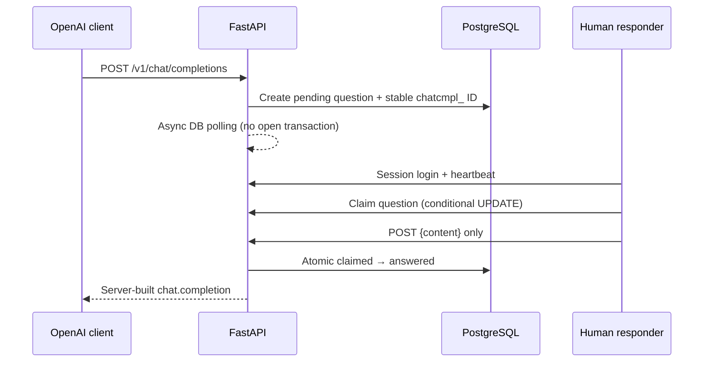

# Human API

[](https://github.com/jzjzzzzzzz/human-api/actions/workflows/ci.yml)
[](LICENSE)
[](docs/OPENAI_COMPATIBILITY.md)

A self-hosted, OpenAI-compatible Chat Completions API where authorized human responders write the answer through a shared web queue.

**Human-powered disclosure:** this is not an autonomous model. API messages are shown to authorized people, may be stored for queue operation and audit, and the API response identifies its origin with `X-Answer-Origin: human`. Callers must not submit passwords, API keys, authentication codes, financial credentials, medical records, or other highly sensitive data.

## The complete path



The responder sees a controlled JSON-shaped editor:

```json
{
  "id": "chatcmpl_server-generated",
  "content": ""
}
```

`id` is visible, copyable, and read-only. Only `content` is editable. The browser submits exactly:

```json
{
  "content": "The human-written answer."
}
```

The server creates `id`, `object`, `created`, `model`, `choices`, assistant role, index, and finish reason.

## Features

- `GET /v1/models`, `GET /v1/models/{model}`, and `POST /v1/chat/completions`
- Official OpenAI SDK compatibility for non-streaming text completions
- HMAC-SHA-256 API-key digests; raw keys are returned once
- HttpOnly responder sessions, Argon2 password hashes, and CSRF validation
- Atomic claims and answers, renewable claim leases, deadlines, cancellation, and audit events
- Database-backed waiting and reconciliation for multi-worker correctness
- Per-key database rate limits and idempotency keys
- Shared queue with polling, presence heartbeat, read-only ID, and controlled content editor
- PostgreSQL, Alembic, FastAPI, React, Docker Compose, tests, and CI

## Quick start

Requirements: Docker with Compose.

```bash
git clone https://github.com/jzjzzzzzzz/human-api.git
cd human-api
cp .env.example .env
```

Replace both pepper values in `.env` with different random values:

```bash
python -c 'import secrets; print(secrets.token_urlsafe(48))'
python -c 'import secrets; print(secrets.token_urlsafe(48))'
```

Start the stack and create an administrator:

```bash
docker compose up --build -d
docker compose exec api python -m scripts.create_user operator@example.test --role admin
```

Open <http://localhost:8080>, sign in, then create an external key through the admin API (the raw key appears once):

```bash
# First sign in and copy csrf_token plus the human_session cookie.
curl -c cookies.txt http://localhost:8080/api/auth/login \
  -H 'Content-Type: application/json' \
  -d '{"email":"operator@example.test","password":"your-password"}'

curl -b cookies.txt http://localhost:8080/api/admin/api-keys \
  -H 'Content-Type: application/json' \
  -H 'X-CSRF-Token: replace-with-login-csrf-token' \
  -d '{"name":"Local client","rate_limit_per_minute":10}'
```

Keep the returned `human_sk_...` value secret.

## OpenAI Python client

```python
from openai import OpenAI

client = OpenAI(
    api_key="human_sk_REPLACE_ME",
    base_url="http://localhost:8080/v1",
    timeout=240.0,
)

response = client.chat.completions.create(
    model="human-1",
    messages=[{"role": "user", "content": "Hello, human model."}],
)

print("ID:", response.id)
print("Answer:", response.choices[0].message.content)
```

The request waits until a responder claims and answers it, or until the configured deadline.

## curl

```bash
curl http://localhost:8080/v1/chat/completions \
  -H 'Authorization: Bearer human_sk_REPLACE_ME' \
  -H 'Content-Type: application/json' \
  -d '{
    "model": "human-1",
    "messages": [{"role": "user", "content": "Hello, human model."}]
  }'
```

## Supported request behavior

Supported roles are `developer`, `system`, `user`, and `assistant`. Content may be a string or text-only content-part array. `stream` must be absent or `false`; `n` must be absent or `1`. Sampling values are validated but do not control a person.

The MVP rejects streaming, multiple choices, tools, function calling, multimodal content, and non-text response formats with structured OpenAI-style errors. It never calls another model or invents an answer.

See [OpenAI compatibility](docs/OPENAI_COMPATIBILITY.md), [operations](docs/OPERATIONS.md), [security](SECURITY.md), and [privacy](docs/PRIVACY.md).

## Tests

```bash
make setup
make lint
make test
```

The backend suite includes a real asynchronous request → queue → atomic claim → strict answer → completion round trip and a concurrent two-responder claim race. `examples/human_llm_e2e.py` exercises running HTTP services through the official OpenAI client.

## Related project

For a grounded personal Q&A agent framework, see [Agent-Me Starter](https://github.com/jzjzzzzzzz/agent-me).

## License

[MIT](LICENSE)
